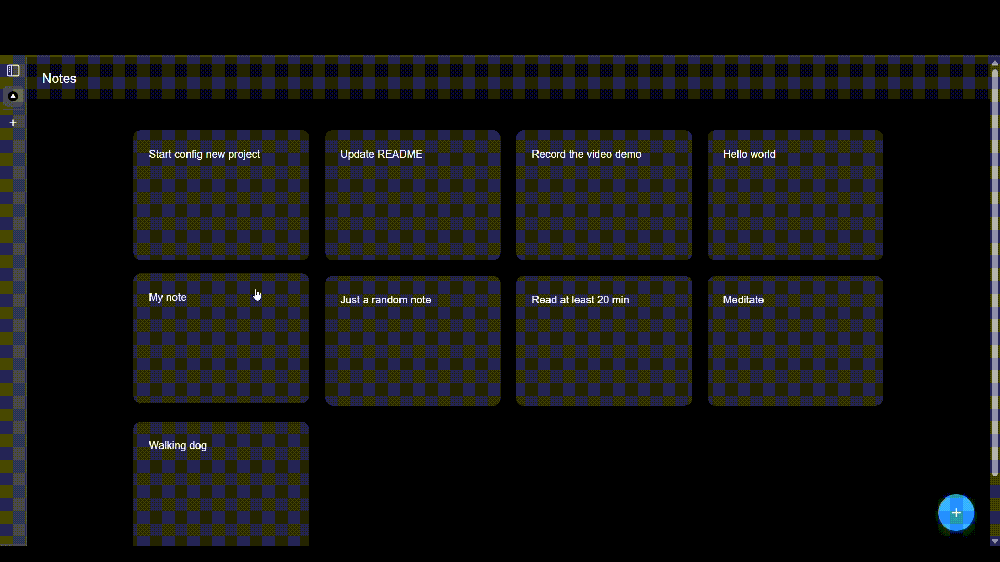

# Next Spring Notes

A modern note-taking application built with Next.js and Spring Boot, following hexagonal architecture principles.

## Features
- ✨ Create and view notes
- 🎯 Coming soon:
  - Edit notes
  - Delete notes

## Tech Stack
### Frontend
- Next.js 
- TypeScript
- Material UI
- React Hooks
- Custom components

### Backend
- Spring Boot 
- Java
- JUnit for testing
- MySQL database
- RESTful APIs

## Architecture
- Hexagonal Architecture (Ports and Adapters)
- Clean code principles
- SOLID principles
- Domain-Driven Design concepts

## API Endpoints
- `GET /api/notes`: Retrieve all notes
- `PUT /api/notes`: Create a new note
- [WIP] `PATCH /api/notes/{id}`: Update a note
- [WIP] `DELETE /api/notes/{id}`: Delete a note
